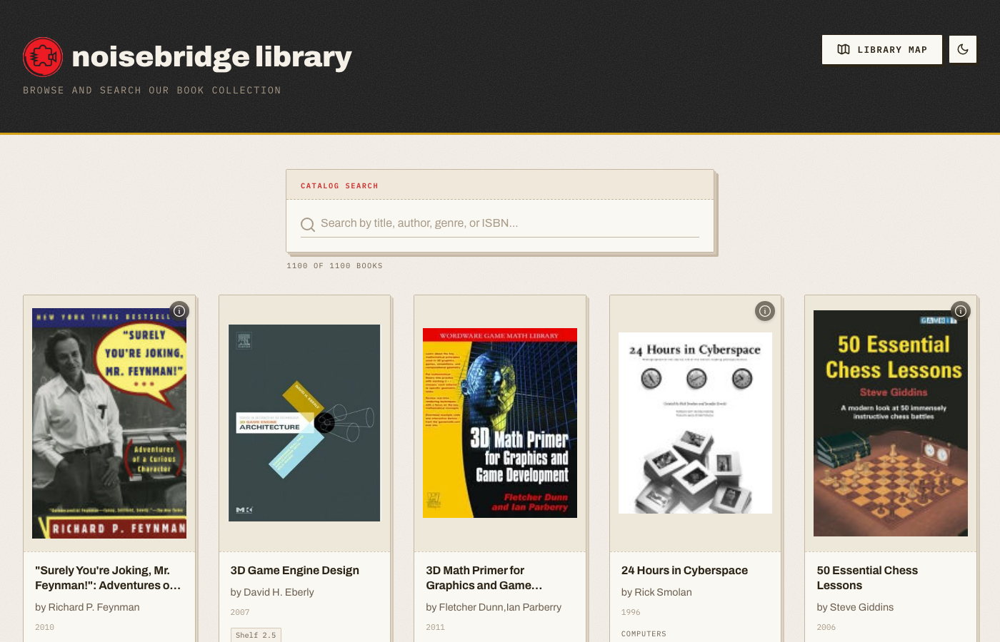

# Noisebridge Library

Search and browse the 1,100+ book catalog at [Noisebridge](https://noisebridge.net), San Francisco's hackerspace.



## Quick Start

```bash
npm install
npm run dev
```

Open http://localhost:5173

## Features

- **Search** by title, author, genre, or ISBN
- **Interactive floorplan** — click a book's shelf location to see where it lives
- **Responsive** — works on phone, tablet, and desktop

## Docker

```bash
docker-compose up
```

Open http://localhost:8080

## Tech

React, Vite, PapaParse. No backend — the catalog is loaded from a CSV at runtime.
